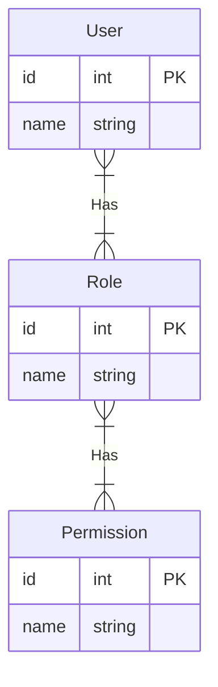

# Spring Framework 学习之旅

这个仓库记录了我对Spring Framework的学习、实践以及理解。
> [Spring makes Java simple, modern, productive and reactive.](https://spring.io/])

# 编写规范

## 项目分层

| 名称         | 含义                        |
|------------|---------------------------|
| annotation | 自定义注解，实现防抖、日志记录等功能        | 
| aspect     | AOP切面配合annotate使用，完成注解的功能 |   
| common     | 常用类，如全局使用的Cache类，亦可细分为其他包 |   
| config     | 配置类，完成各种依赖的整合配置           |   
| constant   | 枚举常量                      |   
| controller | 控制器，负责为HTTP请求指定处理的服务      |   
| cos        | 对象云存储服务                   |   
| dto        | 数据传输对象，接受来自前端的JSON数据      |   
| entity     | 实体，对应数据库中的表               |   
| exception  | 异常类，如不回滚异常等               |   
| mail       | 邮件类                       |   
| mapper     | 数据库映射层，与数据库表进行映射取决于ORM框架  |   
| po         | 普通对象                      |   
| rabbitmq   | 消息队列                      |   
| schedule   | 定时任务                      |   
| security   | 认证权限                      |   
| service    | 服务层，该层只声明接口，impl层负责实现业务逻辑 |   
| util       | 工具类，如字符串工具、日期工具           |   
| vo         | 视图对象，返回给前端的JSON           |   
| wechat     | 微信服务                      |   

## 对象分层

| 名称     | 英文                    | 含义                 |
|--------|-----------------------|--------------------|
| Dto    | Data Transform Object | 数据传输对象，接收前端传入的JSON |
| Vo     | View Object           | 视图对象，返回给前端的JSON    |
| Entity | Entity                | 实体对象，对应数据库中的表      |
| Po     | Plain Object          | 普通对象               |
| Bo     | Business Object       | 业务对象，暂不涉及          |
| Do     | Domain Object         | 领域对象，暂不涉及          |

## API接口设计规范

- 分页等复杂查询使用POST方法，使用JSON传参`POST example`
- 使用ID获取单条记录，使用路径传参`GET example/1`
- 使用外键查询单条记录，例如根据用户id查询银行卡号，使用JSON传参`POST example`
- 修改使用PUT方法，使用JSON传参 `PUT example`
- 删除使用DELETE方法，使用路径传参`DELETE example/1 `
- 分组查询，使用JSON传入参`POST example/groupby-xxx`
- 上传文件使用form-data
- 下载文件使用`GET download/1`

## 对于Controller、Service、Mapper的职能划分

- 保证Mapper层方法的单精度特性
- 业务逻辑封装在Service这一层，不要分散在Controller层，也不要出现在Mapper层
- 当某一个业务功能需要使用其他模块的业务功能时，尽量的调用别人的Service，而不是深入到其他模块的Mapper细节

## 调用规范

- MapperA只允许ServiceA进行调用
- ServiceA不可直接操纵MapperB
- ServiceA如果需要B的数据，只允许通过ServiceB进行调用

## 编写规范

- ServiceImp的外键必须添加为Vo且抽象成AddXXInfo方法
- 涉及到跨层外键，如银行账户查用户再查公司，应该把查用户和查公司写入用户服务

## RBAC权限管理

基于角色的访问控制（Role-Based Access
Control）基本思想为：将权限授予角色，再为用户指定角色，实现用户与权限的间接绑定。每一种角色包含一系列权限，一旦用户被分配了角色，用户就拥有该角色所对应的所有权限。

- 一个用户可以包含多个角色，一个角色可以包含多种权限，为两组多对多关系

- RBAC共需维护三张主表，分别为User、Role、Permission

- 以及两张外键表User_Role和Role_Permission

